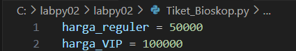
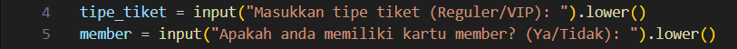
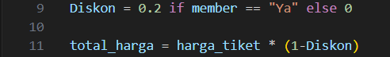
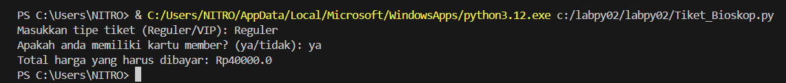
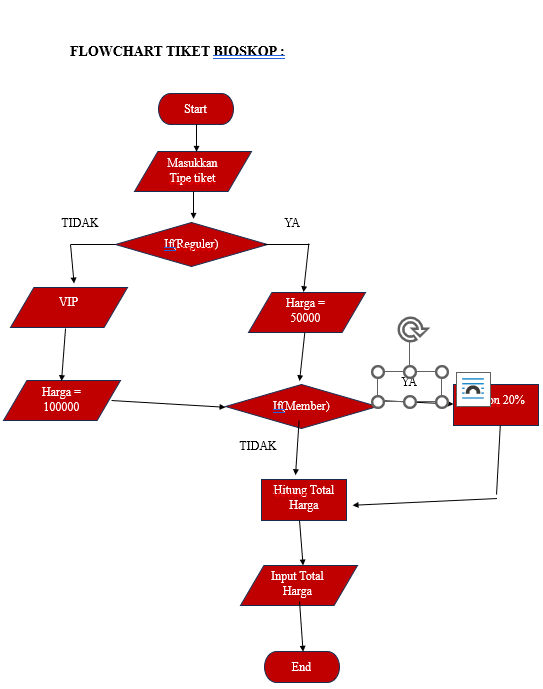
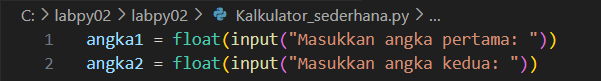
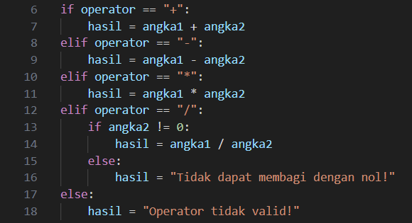
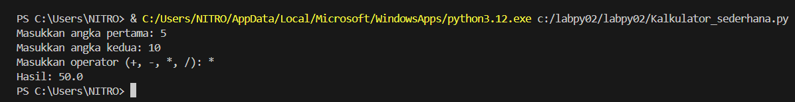
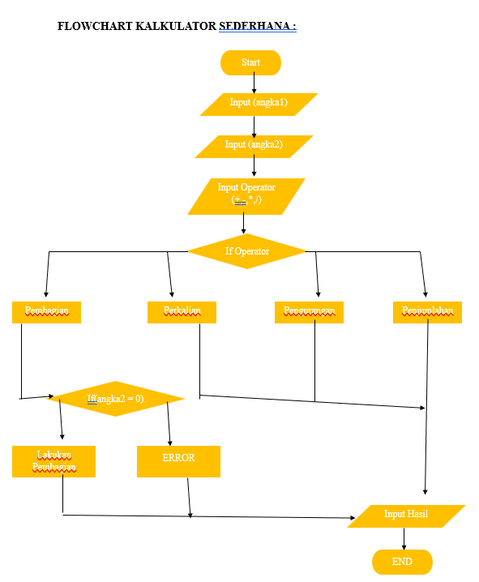

# labpy02

# Code Program Pemesanan TIKET BIOSKOP

## Langkah 1 = Masukkan Harga Tiket

Masukkan Harga tiket bioskop Reguler dan VIP. Reguler = 50000 dan VIP = 100000

## Langkah 2 = Meminta input dari User

Program meminta user memasukkan tipe tiket (reguler atau VIP) dan status apakah mereka punya kartu member.

## Langkah 3 = Menentukan Harga Tiket berdasarkan tipe

jika tipe_tiket adalah "reguler", maka harga_tiket diset ke Rp50.000, jika tidak, diset ke Rp100.000.

## Langkah 4 = Menerapkan Diskon jika User mempunyai kartu member

Jika user memiliki kartu member, diskon 20% diterapkan.
Jika tidak, diskon diset ke 0.

## Langkah 5 = Menghitung total Harga Tiket

## Langkah 6 = Menampilkan Hasil
Program menampilkan total harga yang harus dibayar oleh user.

## FLOWCHART PEMESANAN TIKET BIOSKOP

# Code Program Kalkulator Sederhana

## Langkah 1 = Meminta input dari User
User diminta memasukkan dua angka dan operator (penjumlahan, pengurangan, perkalian, atau pembagian).
Angka dikonversi ke float agar bisa menerima bilangan desimal.

## Langkah 2 = Memilih operasi aritmatika dengan if-elif-else
Program mengecek operator yang dipilih menggunakan if-elif-else.
Jika operator adalah '+', program menjumlahkan dua angka.
Jika '-', mengurangi.
Jika '*', mengalikan.
Jika '/', melakukan pembagian.
Untuk pembagian, ada pengecekan tambahan: jika angka kedua adalah nol, program menampilkan pesan error karena pembagian dengan nol tidak diperbolehkan.
Jika operator tidak valid (misalnya #), program menampilkan pesan kesalahan.

## Langkah 3 = Menampilkan hasil
Program menampilkan hasil operasi atau pesan kesalahan jika ada.

## Langkah 4 = Test Code Program

## FLOWCHART Kalkulator Sederhana

